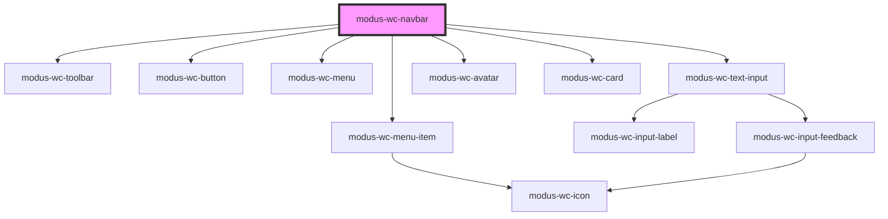

# modus-wc-navbar

<!-- Auto Generated Below -->

## Overview

A customizable navbar component used for top level navigation of all Trimble applications.

Adheres to WCAG 2.2 standards.

## Properties

| Property            | Attribute            | Description                                                               | Type                             | Default                                                                                                                                       |
| ------------------- | -------------------- | ------------------------------------------------------------------------- | -------------------------------- | --------------------------------------------------------------------------------------------------------------------------------------------- |
| `condensed`         | `condensed`          | Applies condensed layout and styling.                                     | `boolean \| undefined`           | `false`                                                                                                                                       |
| `customClass`       | `custom-class`       | Custom CSS class to apply to the host element.                            | `string \| undefined`            | `''`                                                                                                                                          |
| `searchDebounceMs`  | `search-debounce-ms` | Debounce time in milliseconds for search input changes. Default is 300ms. | `number \| undefined`            | `300`                                                                                                                                         |
| `user` _(required)_ | `user`               | User information used to render the user card.                            | `IUserCard`                      | `undefined`                                                                                                                                   |
| `visibility`        | `visibility`         | The visibility of individual navbar buttons.                              | `INavbarVisibility \| undefined` | `{     apps: true,     help: true,     mainMenu: true,     notifications: true,     search: true,     searchInput: true,     user: true,   }` |

## Events

| Event                | Description                                                                                       | Type                                       |
| -------------------- | ------------------------------------------------------------------------------------------------- | ------------------------------------------ |
| `appsClick`          | Event emitted when the apps button is clicked or activated via keyboard.                          | `CustomEvent<KeyboardEvent \| MouseEvent>` |
| `helpClick`          | Event emitted when the help button is clicked or activated via keyboard.                          | `CustomEvent<KeyboardEvent \| MouseEvent>` |
| `myTrimbleClick`     | Event emitted when the user profile Access MyTrimble button is clicked or activated via keyboard. | `CustomEvent<KeyboardEvent \| MouseEvent>` |
| `notificationsClick` | Event emitted when the notifications button is clicked or activated via keyboard.                 | `CustomEvent<KeyboardEvent \| MouseEvent>` |
| `searchChange`       | Event emitted when the search input value is changed.                                             | `CustomEvent<{ value: string; }>`          |
| `searchClick`        | Event emitted when the search button is clicked or activated via keyboard.                        | `CustomEvent<KeyboardEvent \| MouseEvent>` |
| `signOutClick`       | Event emitted when the user profile sign out button is clicked or activated via keyboard.         | `CustomEvent<KeyboardEvent \| MouseEvent>` |
| `trimbleLogoClick`   | Event emitted when the Trimble logo is clicked or activated via keyboard.                         | `CustomEvent<KeyboardEvent \| MouseEvent>` |

## Dependencies

### Depends on

- [modus-wc-toolbar](../modus-wc-toolbar)
- [modus-wc-button](../modus-wc-button)
- [modus-wc-menu](../modus-wc-menu)
- [modus-wc-menu-item](../modus-wc-menu-item)
- [modus-wc-text-input](../modus-wc-text-input)
- [modus-wc-avatar](../modus-wc-avatar)
- [modus-wc-card](../modus-wc-card)

### Graph

----------------------------------------------

*Built with [StencilJS](https://stenciljs.com/)*
