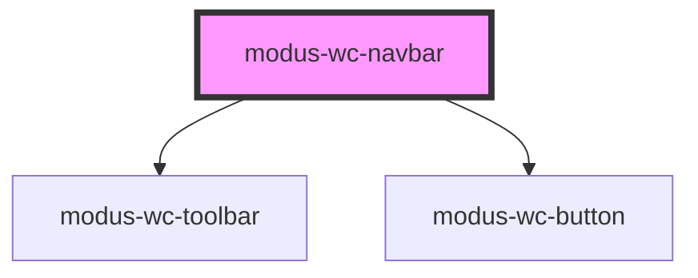

# modus-wc-navbar

<!-- Auto Generated Below -->

## Overview

A customizable navbar component used for top level navigation of all Trimble applications.

Adheres to WCAG 2.2 standards.

## Properties

| Property      | Attribute      | Description                                    | Type                  | Default |
| ------------- | -------------- | ---------------------------------------------- | --------------------- | ------- |
| `customClass` | `custom-class` | Custom CSS class to apply to the host element. | `string \| undefined` | `''`    |

## Dependencies

### Depends on

- [modus-wc-toolbar](../modus-wc-toolbar)
- [modus-wc-button](../modus-wc-button)

### Graph

----------------------------------------------

*Built with [StencilJS](https://stenciljs.com/)*
