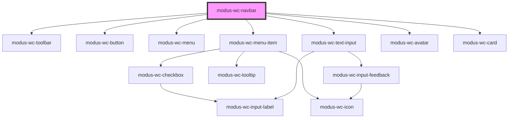

# modus-wc-navbar

<!-- Auto Generated Below -->

## Overview

A customizable navbar component used for top level navigation of all Trimble applications.

The component supports a 'main-menu', 'notifications', and 'apps' `<slot>` for injecting custom HTML menus.
It also supports a 'start', 'center', and 'end' `<slot>` for injecting additional custom HTML

## Properties

| Property                | Attribute                 | Description                                                                                  | Type                                | Default                                                                                                                                                            |
| ----------------------- | ------------------------- | -------------------------------------------------------------------------------------------- | ----------------------------------- | ------------------------------------------------------------------------------------------------------------------------------------------------------------------ |
| `appsMenuOpen`          | `apps-menu-open`          | The open state of the apps menu.                                                             | `boolean \| undefined`              | `false`                                                                                                                                                            |
| `condensed`             | `condensed`               | Applies condensed layout and styling.                                                        | `boolean \| undefined`              | `false`                                                                                                                                                            |
| `condensedMenuOpen`     | `condensed-menu-open`     | The open state of the condensed menu.                                                        | `boolean \| undefined`              | `false`                                                                                                                                                            |
| `customClass`           | `custom-class`            | Custom CSS class to apply to the host element.                                               | `string \| undefined`               | `''`                                                                                                                                                               |
| `mainMenuOpen`          | `main-menu-open`          | The open state of the main menu.                                                             | `boolean \| undefined`              | `false`                                                                                                                                                            |
| `notificationsMenuOpen` | `notifications-menu-open` | The open state of the notifications menu.                                                    | `boolean \| undefined`              | `false`                                                                                                                                                            |
| `searchDebounceMs`      | `search-debounce-ms`      | Debounce time in milliseconds for search input changes. Default is 300ms.                    | `number \| undefined`               | `300`                                                                                                                                                              |
| `searchInputOpen`       | `search-input-open`       | The open state of the search input.                                                          | `boolean \| undefined`              | `false`                                                                                                                                                            |
| `textOverrides`         | `text-overrides`          | Text replacements for the navbar.                                                            | `INavbarTextOverrides \| undefined` | `undefined`                                                                                                                                                        |
| `userCard` _(required)_ | `user-card`               | User information used to render the user card.                                               | `INavbarUserCard`                   | `undefined`                                                                                                                                                        |
| `userMenuOpen`          | `user-menu-open`          | The open state of the user menu.                                                             | `boolean \| undefined`              | `false`                                                                                                                                                            |
| `visibility`            | `visibility`              | The visibility of individual navbar buttons. Default is user profile visible, others hidden. | `INavbarVisibility \| undefined`    | `{     ai: false,     apps: false,     help: false,     mainMenu: false,     notifications: false,     search: false,     searchInput: false,     user: true,   }` |

## Events

| Event                         | Description                                                                                       | Type                                       |
| ----------------------------- | ------------------------------------------------------------------------------------------------- | ------------------------------------------ |
| `aiClick`                     | Event emitted when the AI button is clicked or activated via keyboard.                            | `CustomEvent<KeyboardEvent \| MouseEvent>` |
| `appsClick`                   | Event emitted when the apps button is clicked or activated via keyboard.                          | `CustomEvent<KeyboardEvent \| MouseEvent>` |
| `appsMenuOpenChange`          | Event emitted when the apps menu open state changes.                                              | `CustomEvent<boolean>`                     |
| `condensedMenuOpenChange`     | Event emitted when the condensed menu open state changes.                                         | `CustomEvent<boolean>`                     |
| `helpClick`                   | Event emitted when the help button is clicked or activated via keyboard.                          | `CustomEvent<KeyboardEvent \| MouseEvent>` |
| `mainMenuOpenChange`          | Event emitted when the main menu open state changes.                                              | `CustomEvent<boolean>`                     |
| `myTrimbleClick`              | Event emitted when the user profile Access MyTrimble button is clicked or activated via keyboard. | `CustomEvent<KeyboardEvent \| MouseEvent>` |
| `notificationsClick`          | Event emitted when the notifications button is clicked or activated via keyboard.                 | `CustomEvent<KeyboardEvent \| MouseEvent>` |
| `notificationsMenuOpenChange` | Event emitted when the notifications menu open state changes.                                     | `CustomEvent<boolean>`                     |
| `searchChange`                | Event emitted when the search input value is changed.                                             | `CustomEvent<{ value: string; }>`          |
| `searchClick`                 | Event emitted when the search button is clicked or activated via keyboard.                        | `CustomEvent<KeyboardEvent \| MouseEvent>` |
| `searchInputOpenChange`       | Event emitted when the search input open state changes.                                           | `CustomEvent<boolean>`                     |
| `signOutClick`                | Event emitted when the user profile sign out button is clicked or activated via keyboard.         | `CustomEvent<KeyboardEvent \| MouseEvent>` |
| `trimbleLogoClick`            | Event emitted when the Trimble logo is clicked or activated via keyboard.                         | `CustomEvent<KeyboardEvent \| MouseEvent>` |
| `userMenuOpenChange`          | Event emitted when the user menu open state changes.                                              | `CustomEvent<boolean>`                     |

## Dependencies

### Depends on

- [modus-wc-toolbar](../modus-wc-toolbar)
- [modus-wc-button](../modus-wc-button)
- [modus-wc-menu](../modus-wc-menu)
- [modus-wc-menu-item](../modus-wc-menu-item)
- [modus-wc-text-input](../modus-wc-text-input)
- [modus-wc-avatar](../modus-wc-avatar)
- [modus-wc-card](../modus-wc-card)

### Graph

----------------------------------------------

*Built with [StencilJS](https://stenciljs.com/)*
