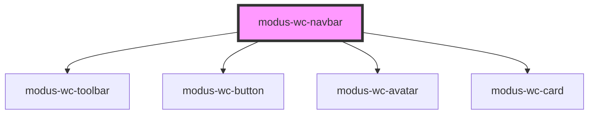

# modus-wc-navbar

<!-- Auto Generated Below -->

## Overview

A customizable navbar component used for top level navigation of all Trimble applications.

Adheres to WCAG 2.2 standards.

## Properties

| Property            | Attribute      | Description                                    | Type                             | Default     |
| ------------------- | -------------- | ---------------------------------------------- | -------------------------------- | ----------- |
| `customClass`       | `custom-class` | Custom CSS class to apply to the host element. | `string \| undefined`            | `''`        |
| `user` _(required)_ | `user`         | User information used to render the user card. | `IUserCard`                      | `undefined` |
| `visibility`        | `visibility`   | The visibility of individual navbar buttons.   | `INavbarVisibility \| undefined` | `undefined` |

## Events

| Event              | Description                                                                                       | Type                                       |
| ------------------ | ------------------------------------------------------------------------------------------------- | ------------------------------------------ |
| `helpClick`        | Event emitted when the help button is clicked or activated via keyboard.                          | `CustomEvent<KeyboardEvent \| MouseEvent>` |
| `myTrimbleClick`   | Event emitted when the user profile Access MyTrimble button is clicked or activated via keyboard. | `CustomEvent<KeyboardEvent \| MouseEvent>` |
| `signOutClick`     | Event emitted when the user profile sign out button is clicked or activated via keyboard.         | `CustomEvent<KeyboardEvent \| MouseEvent>` |
| `trimbleLogoClick` | Event emitted when the Trimble logo is clicked or activated via keyboard.                         | `CustomEvent<KeyboardEvent \| MouseEvent>` |

## Dependencies

### Depends on

- [modus-wc-toolbar](../modus-wc-toolbar)
- [modus-wc-button](../modus-wc-button)
- [modus-wc-avatar](../modus-wc-avatar)
- [modus-wc-card](../modus-wc-card)

### Graph

----------------------------------------------

*Built with [StencilJS](https://stenciljs.com/)*
