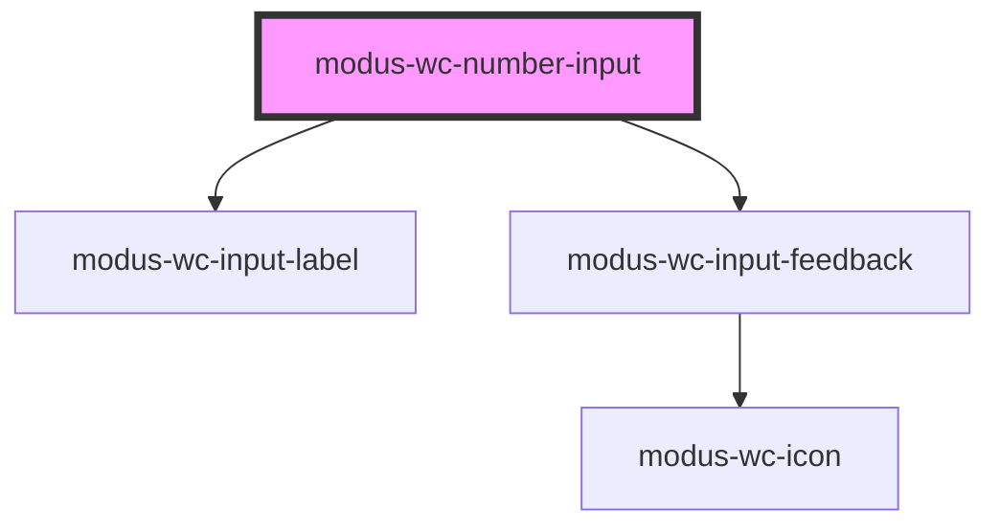

# modus-wc-text-input

<!-- Auto Generated Below -->

## Overview

A customizable input component used to create number inputs with types.

Adheres to WCAG 2.2 standards.

## Properties

| Property         | Attribute         | Description                                                                                                                                                              | Type                                | Default     |
| ---------------- | ----------------- | ------------------------------------------------------------------------------------------------------------------------------------------------------------------------ | ----------------------------------- | ----------- |
| `autoComplete`   | `auto-complete`   | Hint for form autofill feature.                                                                                                                                          | `"off" \| "on" \| undefined`        | `undefined` |
| `bordered`       | `bordered`        | Indicates that the input should have a border.                                                                                                                           | `boolean \| undefined`              | `true`      |
| `currencySymbol` | `currency-symbol` | The currency symbol to display.                                                                                                                                          | `string \| undefined`               | `''`        |
| `customClass`    | `custom-class`    | Custom CSS class to apply to the input.                                                                                                                                  | `string \| undefined`               | `''`        |
| `disabled`       | `disabled`        | Whether the form control is disabled.                                                                                                                                    | `boolean \| undefined`              | `false`     |
| `feedback`       | --                | Feedback to render below the input.                                                                                                                                      | `IInputFeedbackProp \| undefined`   | `undefined` |
| `inputId`        | `input-id`        | The ID of the input element.                                                                                                                                             | `string \| undefined`               | `undefined` |
| `inputMode`      | `input-mode`      | Hints at the type of data that might be entered by the user while editing the element or its contents. This allows a browser to display an appropriate virtual keyboard. | `"decimal" \| "none" \| "numeric"`  | `'numeric'` |
| `inputTabIndex`  | `input-tab-index` | Determine the control's relative ordering for sequential focus navigation (typically with the Tab key).                                                                  | `number \| undefined`               | `undefined` |
| `label`          | `label`           | The text to display within the label.                                                                                                                                    | `string \| undefined`               | `undefined` |
| `max`            | `max`             | The input's maximum value.                                                                                                                                               | `number \| undefined`               | `undefined` |
| `min`            | `min`             | The input's minimum value.                                                                                                                                               | `number \| undefined`               | `undefined` |
| `name`           | `name`            | Name of the form control. Submitted with the form as part of a name/value pair.                                                                                          | `string \| undefined`               | `undefined` |
| `placeholder`    | `placeholder`     | Text that appears in the form control when it has no value set.                                                                                                          | `string \| undefined`               | `''`        |
| `readOnly`       | `read-only`       | Whether the value is editable.                                                                                                                                           | `boolean \| undefined`              | `false`     |
| `required`       | `required`        | A value is required for the form to be submittable.                                                                                                                      | `boolean \| undefined`              | `false`     |
| `size`           | `size`            | The size of the input.                                                                                                                                                   | `"lg" \| "md" \| "sm" \| undefined` | `'md'`      |
| `step`           | `step`            | The granularity that the value adheres to.                                                                                                                               | `number \| undefined`               | `undefined` |
| `type`           | `type`            | Type of form control.                                                                                                                                                    | `"number" \| "range" \| undefined`  | `'number'`  |
| `value`          | `value`           | The value of the control.                                                                                                                                                | `string`                            | `''`        |

## Events

| Event         | Description                                 | Type                      |
| ------------- | ------------------------------------------- | ------------------------- |
| `inputBlur`   | Event emitted when the input loses focus.   | `CustomEvent<FocusEvent>` |
| `inputChange` | Event emitted when the input value changes. | `CustomEvent<InputEvent>` |
| `inputFocus`  | Event emitted when the input gains focus.   | `CustomEvent<FocusEvent>` |

## Dependencies

### Depends on

- [modus-wc-input-label](../modus-wc-input-label)
- [modus-wc-input-feedback](../modus-wc-input-feedback)

### Graph

----------------------------------------------

*Built with [StencilJS](https://stenciljs.com/)*
