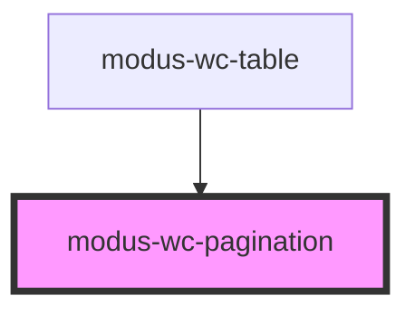

# modus-wc-pagination

<!-- Auto Generated Below -->

## Overview

Pagination component to navigate through pages of content.

Adheres to WCAG 2.2 standards.

## Properties

| Property          | Attribute           | Description                              | Type                            | Default     |
| ----------------- | ------------------- | ---------------------------------------- | ------------------------------- | ----------- |
| `ariaLabelValues` | `aria-label-values` | Aria label values for pagination buttons | `IAriaLabelValues \| undefined` | `undefined` |
| `count`           | `count`             | Total number of pages                    | `number`                        | `1`         |
| `customClass`     | `custom-class`      | Custom CSS class to apply                | `string \| undefined`           | `''`        |
| `page`            | `page`              | The current page number                  | `number`                        | `1`         |
| `size`            | `size`              | Size of the pagination buttons           | `"lg" \| "md" \| "sm"`          | `'md'`      |

## Events

| Event        | Description                     | Type                       |
| ------------ | ------------------------------- | -------------------------- |
| `pageChange` | Event emitted when page changes | `CustomEvent<IPageChange>` |

## Dependencies

### Used by

 - [modus-wc-table](../modus-wc-table)

### Graph

----------------------------------------------

*Built with [StencilJS](https://stenciljs.com/)*
