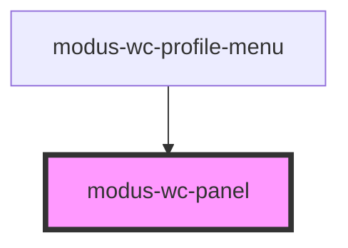

# modus-wc-panel

<!-- Auto Generated Below -->

## Overview

A customizable panel component used to organize content in a structured layout.

This component provides 'header', 'body', and 'footer' `<slot>` elements for inserting custom HTML.

## Properties

| Property      | Attribute      | Description                                 | Type                   | Default   |
| ------------- | -------------- | ------------------------------------------- | ---------------------- | --------- |
| `customClass` | `custom-class` | Custom CSS class to apply to the outer div. | `string \| undefined`  | `''`      |
| `floating`    | `floating`     | Enable floating mode with elevated shadow.  | `boolean \| undefined` | `false`   |
| `height`      | `height`       | Height of the panel in pixels.              | `string \| undefined`  | `'700px'` |
| `width`       | `width`        | Width of the panel in pixels.               | `string \| undefined`  | `'350px'` |

## Dependencies

### Used by

 - [modus-wc-profile-menu](../modus-wc-profile-menu)

### Graph

----------------------------------------------

*Built with [StencilJS](https://stenciljs.com/)*
