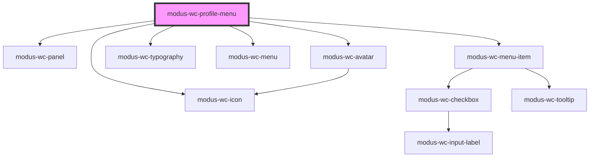

# modus-wc-profile-menu

<!-- Auto Generated Below -->

## Properties

| Property                    | Attribute       | Description                                                 | Type                    | Default     |
| --------------------------- | --------------- | ----------------------------------------------------------- | ----------------------- | ----------- |
| `menuOne`                   | `menu-one`      | Configuration for the first menu including title and items  | `ISubMenu \| undefined` | `undefined` |
| `menuTwo`                   | `menu-two`      | Configuration for the second menu including title and items | `ISubMenu \| undefined` | `undefined` |
| `profileProps` _(required)_ | `profile-props` | Profile menu properties containing user information         | `IProfileMenuProps`     | `undefined` |

## Events

| Event           | Description                                                                 | Type                  |
| --------------- | --------------------------------------------------------------------------- | --------------------- |
| `menuItemClick` | Emitted when any menu item is clicked, passing back the item value or label | `CustomEvent<string>` |
| `signOutClick`  | Emitted when the Sign Out menu item is clicked                              | `CustomEvent<void>`   |

## Dependencies

### Depends on

- [modus-wc-panel](../modus-wc-panel)
- [modus-wc-avatar](../modus-wc-avatar)
- [modus-wc-typography](../modus-wc-typography)
- [modus-wc-menu](../modus-wc-menu)
- [modus-wc-menu-item](../modus-wc-menu-item)
- [modus-wc-icon](../modus-wc-icon)

### Graph

----------------------------------------------

*Built with [StencilJS](https://stenciljs.com/)*
