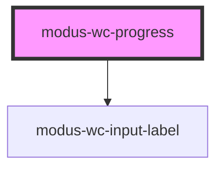

# modus-wc-progress

<!-- Auto Generated Below -->

## Overview

A customizable progress component used to show the progress of a task or show the passing of time.

The radial variant supports slotting in custom HTML to be displayed within the progress circle.

## Properties

| Property        | Attribute       | Description                                        | Type                                 | Default     |
| --------------- | --------------- | -------------------------------------------------- | ------------------------------------ | ----------- |
| `customClass`   | `custom-class`  | Custom CSS class to apply to the progress element. | `string \| undefined`                | `''`        |
| `indeterminate` | `indeterminate` | The indeterminate state of the progress component. | `boolean`                            | `false`     |
| `label`         | `label`         | A text label to render within the progress bar     | `string \| undefined`                | `undefined` |
| `max`           | `max`           | The progress component's maximum value.            | `number \| undefined`                | `100`       |
| `value`         | `value`         | The value of the progress component.               | `number`                             | `0`         |
| `variant`       | `variant`       | The variant of the progress component.             | `"default" \| "radial" \| undefined` | `'default'` |

## Dependencies

### Depends on

- [modus-wc-input-label](../modus-wc-input-label)

### Graph

----------------------------------------------

*Built with [StencilJS](https://stenciljs.com/)*
