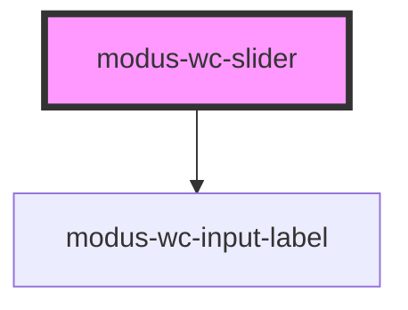

# modus-wc-slider

<!-- Auto Generated Below -->

## Overview

A customizable slider component.

Dual-range mode renders a single container with two custom thumb elements
(role="slider") and hidden inputs for form submission. This avoids the
interaction and accessibility problems of two overlapping native range inputs.

## Properties

| Property        | Attribute         | Description                                                                        | Type                                | Default     |
| --------------- | ----------------- | ---------------------------------------------------------------------------------- | ----------------------------------- | ----------- |
| `customClass`   | `custom-class`    | Custom CSS class to apply to the inner div.                                        | `string \| undefined`               | `''`        |
| `disabled`      | `disabled`        | The disabled state of the slider.                                                  | `boolean \| undefined`              | `false`     |
| `dualRange`     | `dual-range`      | When true, renders two thumbs for selecting a range between minValue and maxValue. | `boolean \| undefined`              | `false`     |
| `inputId`       | `input-id`        | The ID of the input element.                                                       | `string \| undefined`               | `undefined` |
| `inputTabIndex` | `input-tab-index` | The tabindex of the input.                                                         | `number \| undefined`               | `undefined` |
| `label`         | `label`           | The text to display within the label.                                              | `string \| undefined`               | `undefined` |
| `max`           | `max`             | The upper bound of the slider track.                                               | `number \| undefined`               | `100`       |
| `maxValue`      | `max-value`       | The upper selected value in dual-range mode.                                       | `number \| undefined`               | `undefined` |
| `min`           | `min`             | The lower bound of the slider track.                                               | `number \| undefined`               | `0`         |
| `minValue`      | `min-value`       | The lower selected value in dual-range mode.                                       | `number \| undefined`               | `undefined` |
| `name`          | `name`            | Name of the form control. Submitted with the form as part of a name/value pair.    | `string \| undefined`               | `''`        |
| `required`      | `required`        | A value is required for the form to be submittable.                                | `boolean \| undefined`              | `false`     |
| `size`          | `size`            | The size of the input.                                                             | `"lg" \| "md" \| "sm" \| undefined` | `'md'`      |
| `step`          | `step`            | The increment of the slider.                                                       | `number \| undefined`               | `undefined` |
| `value`         | `value`           | The value of the slider (single-range mode).                                       | `number`                            | `0`         |

## Events

| Event         | Description                           | Type                      |
| ------------- | ------------------------------------- | ------------------------- |
| `inputBlur`   | Emitted when the input loses focus.   | `CustomEvent<FocusEvent>` |
| `inputChange` | Emitted when the input value changes. | `CustomEvent<InputEvent>` |
| `inputFocus`  | Emitted when the input gains focus.   | `CustomEvent<FocusEvent>` |

## Methods

### `getDualRangeValues() => Promise<{ minValue: number; maxValue: number; } | null>`

Min/max when `dual-range`; otherwise `null`.

#### Returns

Type: `Promise<{ minValue: number; maxValue: number; } | null>`

### `getSliderValue() => Promise<number>`

Current value of the single-thumb slider.

#### Returns

Type: `Promise<number>`

## Dependencies

### Depends on

- [modus-wc-input-label](../modus-wc-input-label)

### Graph

----------------------------------------------

*Built with [StencilJS](https://stenciljs.com/)*
