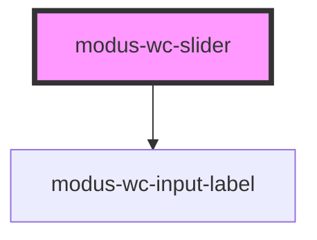

# modus-wc-slider

<!-- Auto Generated Below -->

## Overview

A customizable slider component

## Properties

| Property        | Attribute         | Description                                                                     | Type                                | Default     |
| --------------- | ----------------- | ------------------------------------------------------------------------------- | ----------------------------------- | ----------- |
| `customClass`   | `custom-class`    | Custom CSS class to apply to the inner div.                                     | `string \| undefined`               | `''`        |
| `disabled`      | `disabled`        | The disabled state of the slider.                                               | `boolean \| undefined`              | `false`     |
| `inputId`       | `input-id`        | The ID of the input element.                                                    | `string \| undefined`               | `undefined` |
| `inputTabIndex` | `input-tab-index` | The tabindex of the input.                                                      | `number \| undefined`               | `undefined` |
| `label`         | `label`           | The text to display within the label.                                           | `string \| undefined`               | `undefined` |
| `max`           | `max`             | The maximum slider value.                                                       | `number \| undefined`               | `undefined` |
| `min`           | `min`             | The minimum slider value.                                                       | `number \| undefined`               | `undefined` |
| `name`          | `name`            | Name of the form control. Submitted with the form as part of a name/value pair. | `string \| undefined`               | `''`        |
| `required`      | `required`        | A value is required for the form to be submittable.                             | `boolean \| undefined`              | `false`     |
| `size`          | `size`            | The size of the input.                                                          | `"lg" \| "md" \| "sm" \| undefined` | `'md'`      |
| `step`          | `step`            | The increment of the slider.                                                    | `number \| undefined`               | `undefined` |
| `value`         | `value`           | The value of the slider.                                                        | `number`                            | `0`         |

## Events

| Event         | Description                           | Type                      |
| ------------- | ------------------------------------- | ------------------------- |
| `inputBlur`   | Emitted when the input loses focus.   | `CustomEvent<FocusEvent>` |
| `inputChange` | Emitted when the input value changes. | `CustomEvent<InputEvent>` |
| `inputFocus`  | Emitted when the input gains focus.   | `CustomEvent<FocusEvent>` |

## Dependencies

### Depends on

- [modus-wc-input-label](../modus-wc-input-label)

### Graph

----------------------------------------------

*Built with [StencilJS](https://stenciljs.com/)*
