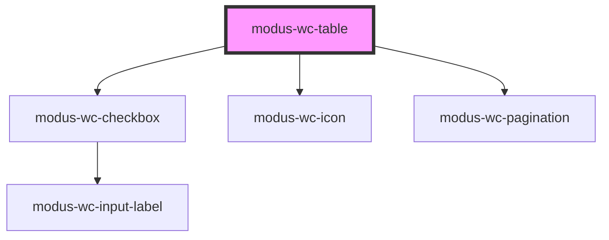

# modus-wc-table

<!-- Auto Generated Below -->

## Properties

| Property               | Attribute                 | Description                                                              | Type                                                                  | Default                |
| ---------------------- | ------------------------- | ------------------------------------------------------------------------ | --------------------------------------------------------------------- | ---------------------- |
| `columns` _(required)_ | `columns`                 |                                                                          | `ITableColumn[]`                                                      | `undefined`            |
| `currentPage`          | `current-page`            |                                                                          | `number`                                                              | `1`                    |
| `customClass`          | `custom-class`            |                                                                          | `string \| undefined`                                                 | `''`                   |
| `data` _(required)_    | `data`                    |                                                                          | `Record<string, unknown>[]`                                           | `undefined`            |
| `density`              | `density`                 |                                                                          | `"comfortable" \| "compact" \| undefined`                             | `'comfortable'`        |
| `editable`             | `editable`                | Enable cell editing. Either a boolean (all rows) or a predicate per row. | `((row: Record<string, unknown>) => boolean) \| boolean \| undefined` | `false`                |
| `hover`                | `hover`                   |                                                                          | `boolean \| undefined`                                                | `true`                 |
| `pageSize`             | `page-size`               |                                                                          | `number`                                                              | `10`                   |
| `pageSizeOptions`      | `page-size-options`       |                                                                          | `number[]`                                                            | `[5, 10, 25, 50, 100]` |
| `paginated`            | `paginated`               |                                                                          | `boolean \| undefined`                                                | `false`                |
| `selectable`           | `selectable`              |                                                                          | `"multi" \| "none" \| "single" \| undefined`                          | `'none'`               |
| `selectedRowIds`       | `selected-row-ids`        |                                                                          | `string[] \| undefined`                                               | `undefined`            |
| `showPageSizeSelector` | `show-page-size-selector` |                                                                          | `boolean \| undefined`                                                | `true`                 |
| `sortable`             | `sortable`                |                                                                          | `boolean \| undefined`                                                | `true`                 |
| `zebra`                | `zebra`                   |                                                                          | `boolean \| undefined`                                                | `false`                |

## Events

| Event                | Description | Type                                                                                                        |
| -------------------- | ----------- | ----------------------------------------------------------------------------------------------------------- |
| `cellEditCommit`     |             | `CustomEvent<{ rowIndex: number; colId: string; newValue: unknown; updatedRow: Record<string, unknown>; }>` |
| `cellEditStart`      |             | `CustomEvent<{ rowIndex: number; colId: string; }>`                                                         |
| `paginationChange`   |             | `CustomEvent<IPaginationChangeEventDetail>`                                                                 |
| `rowClick`           |             | `CustomEvent<{ row: Record<string, unknown>; index: number; }>`                                             |
| `rowSelectionChange` |             | `CustomEvent<{ selectedRows: Record<string, unknown>[]; selectedRowIds: string[]; }>`                       |
| `sortChange`         |             | `CustomEvent<ColumnSort[]>`                                                                                 |

## Dependencies

### Depends on

- [modus-wc-checkbox](../modus-wc-checkbox)
- [modus-wc-icon](../modus-wc-icon)
- [modus-wc-pagination](../modus-wc-pagination)

### Graph

----------------------------------------------

*Built with [StencilJS](https://stenciljs.com/)*
