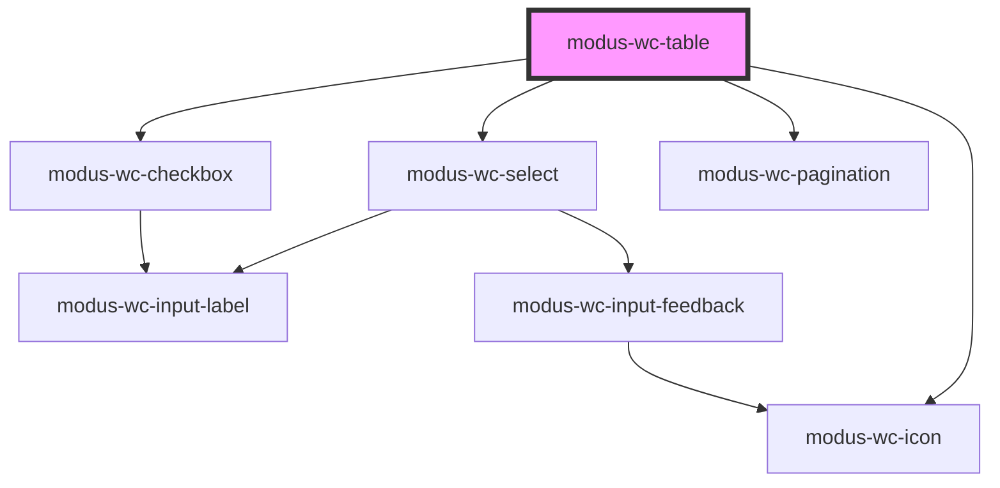

# modus-wc-table

<!-- Auto Generated Below -->

## Properties

| Property               | Attribute                 | Description                                                                                      | Type                                                                  | Default         |
| ---------------------- | ------------------------- | ------------------------------------------------------------------------------------------------ | --------------------------------------------------------------------- | --------------- |
| `caption`              | `caption`                 | Accessibility caption for the table (visually hidden but available to screen readers).           | `string \| undefined`                                                 | `undefined`     |
| `columns` _(required)_ | `columns`                 | An array of column definitions.                                                                  | `ITableColumn[]`                                                      | `undefined`     |
| `currentPage`          | `current-page`            | The current page number in pagination (1-based index).                                           | `number`                                                              | `1`             |
| `customClass`          | `custom-class`            | Custom CSS class to apply to the inner div.                                                      | `string \| undefined`                                                 | `''`            |
| `data` _(required)_    | `data`                    | An array of data objects.                                                                        | `Record<string, unknown>[]`                                           | `undefined`     |
| `density`              | `density`                 | The density of the table, used to save space or increase readability.                            | `"comfortable" \| "compact" \| "relaxed" \| undefined`                | `'comfortable'` |
| `editable`             | `editable`                | Enable cell editing. Either a boolean (all rows) or a predicate per row.                         | `((row: Record<string, unknown>) => boolean) \| boolean \| undefined` | `false`         |
| `hover`                | `hover`                   | Enable hover effect on table rows.                                                               | `boolean \| undefined`                                                | `true`          |
| `pageSizeOptions`      | `page-size-options`       | Available options for the number of rows per page.                                               | `number[]`                                                            | `[5, 10, 15]`   |
| `paginated`            | `paginated`               | Enable pagination for the table.                                                                 | `boolean \| undefined`                                                | `false`         |
| `selectable`           | `selectable`              | Row selection mode: 'none' for no selection, 'single' for single row, 'multi' for multiple rows. | `"multi" \| "none" \| "single" \| undefined`                          | `'none'`        |
| `selectedRowIds`       | `selected-row-ids`        | Array of selected row IDs. Used for controlled selection state.                                  | `string[] \| undefined`                                               | `undefined`     |
| `showPageSizeSelector` | `show-page-size-selector` | Show/hide the page size selector in pagination.                                                  | `boolean \| undefined`                                                | `true`          |
| `sortable`             | `sortable`                | Enable sorting functionality for sortable columns.                                               | `boolean \| undefined`                                                | `true`          |
| `zebra`                | `zebra`                   | Zebra striped tables differentiate rows by styling them in an alternating fashion.               | `boolean \| undefined`                                                | `false`         |

## Events

| Event                | Description                                                            | Type                                                                                                        |
| -------------------- | ---------------------------------------------------------------------- | ----------------------------------------------------------------------------------------------------------- |
| `cellEditCommit`     | Emits when cell editing is committed with the new value.               | `CustomEvent<{ rowIndex: number; colId: string; newValue: unknown; updatedRow: Record<string, unknown>; }>` |
| `cellEditStart`      | Emits when cell editing starts.                                        | `CustomEvent<{ rowIndex: number; colId: string; }>`                                                         |
| `paginationChange`   | Emits when pagination changes with the new pagination state.           | `CustomEvent<IPaginationChangeEventDetail>`                                                                 |
| `rowClick`           | Emits when a row is clicked.                                           | `CustomEvent<{ row: Record<string, unknown>; index: number; }>`                                             |
| `rowSelectionChange` | Emits when row selection changes with the selected rows and their IDs. | `CustomEvent<{ selectedRows: Record<string, unknown>[]; selectedRowIds: string[]; }>`                       |
| `sortChange`         | Emits when sorting changes with the new sorting state.                 | `CustomEvent<ColumnSort[]>`                                                                                 |

## Dependencies

### Depends on

- [modus-wc-select](../modus-wc-select)
- [modus-wc-checkbox](../modus-wc-checkbox)
- [modus-wc-icon](../modus-wc-icon)
- [modus-wc-pagination](../modus-wc-pagination)

### Graph

----------------------------------------------

*Built with [StencilJS](https://stenciljs.com/)*
