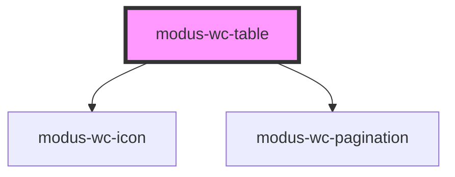

# modus-wc-table

<!-- Auto Generated Below -->

## Properties

| Property               | Attribute                 | Description | Type                                      | Default                |
| ---------------------- | ------------------------- | ----------- | ----------------------------------------- | ---------------------- |
| `columns` _(required)_ | `columns`                 |             | `ITableColumn[]`                          | `undefined`            |
| `currentPage`          | `current-page`            |             | `number`                                  | `1`                    |
| `customClass`          | `custom-class`            |             | `string \| undefined`                     | `''`                   |
| `data` _(required)_    | `data`                    |             | `Record<string, unknown>[]`               | `undefined`            |
| `density`              | `density`                 |             | `"comfortable" \| "compact" \| undefined` | `'comfortable'`        |
| `hover`                | `hover`                   |             | `boolean \| undefined`                    | `true`                 |
| `pageSize`             | `page-size`               |             | `number`                                  | `10`                   |
| `pageSizeOptions`      | `page-size-options`       |             | `number[]`                                | `[5, 10, 25, 50, 100]` |
| `paginated`            | `paginated`               |             | `boolean \| undefined`                    | `false`                |
| `showPageSizeSelector` | `show-page-size-selector` |             | `boolean \| undefined`                    | `true`                 |
| `sortable`             | `sortable`                |             | `boolean \| undefined`                    | `true`                 |
| `zebra`                | `zebra`                   |             | `boolean \| undefined`                    | `false`                |

## Events

| Event              | Description | Type                                                            |
| ------------------ | ----------- | --------------------------------------------------------------- |
| `paginationChange` |             | `CustomEvent<IPaginationChangeEventDetail>`                     |
| `rowClick`         |             | `CustomEvent<{ row: Record<string, unknown>; index: number; }>` |
| `sortChange`       |             | `CustomEvent<ColumnSort[]>`                                     |

## Dependencies

### Depends on

- [modus-wc-icon](../modus-wc-icon)
- [modus-wc-pagination](../modus-wc-pagination)

### Graph

----------------------------------------------

*Built with [StencilJS](https://stenciljs.com/)*
