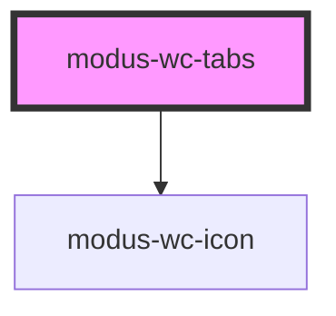

# modus-wc-avatar

<!-- Auto Generated Below -->

## Overview

A customizable tabs component used to create groups of tabs.

The component supports a `<slot>` for injecting custom tab content.

## Properties

| Property         | Attribute          | Description                                 | Type                                                       | Default      |
| ---------------- | ------------------ | ------------------------------------------- | ---------------------------------------------------------- | ------------ |
| `activeTabIndex` | `active-tab-index` | The current active tab                      | `number`                                                   | `0`          |
| `customClass`    | `custom-class`     | Custom CSS class to apply to the inner div. | `string \| undefined`                                      | `''`         |
| `size`           | `size`             | The size of the tabs.                       | `"lg" \| "md" \| "sm" \| undefined`                        | `'md'`       |
| `tabStyle`       | `tab-style`        | Additional styling for the tabs.            | `"bordered" \| "boxed" \| "lifted" \| "none" \| undefined` | `'bordered'` |
| `tabs`           | `tabs`             | The tabs to display.                        | `ITab[]`                                                   | `[]`         |

## Events

| Event       | Description                                                        | Type                                                    |
| ----------- | ------------------------------------------------------------------ | ------------------------------------------------------- |
| `tabChange` | When a tab is switched to, this event outputs the relevant indices | `CustomEvent<{ previousTab: number; newTab: number; }>` |

## Dependencies

### Depends on

- [modus-wc-icon](../modus-wc-icon)

### Graph

----------------------------------------------

*Built with [StencilJS](https://stenciljs.com/)*
