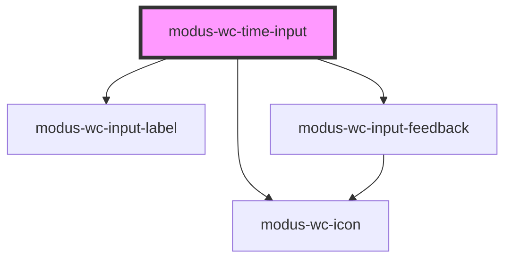

# modus-wc-time-input

<!-- Auto Generated Below -->

## Overview

A customizable time input with a Modus text field and dropdown
(scrollable picker wheels or a datalist of interval options).

`value` is always stored and emitted in 24-hour format (`HH:mm` or `HH:mm:ss`).
The field uses a segmented `--:--` skeleton (native time-input style) with
keyboard segment editing. `format` controls display and the Modus picker
(`12hrs` wheels + AM/PM vs `24hrs`). Open the picker with the clock button or
Alt+ArrowDown.

Adheres to WCAG 2.2 standards.

## Properties

| Property          | Attribute          | Description                                                                                                                                                                                                                                            | Type                                  | Default     |
| ----------------- | ------------------ | ------------------------------------------------------------------------------------------------------------------------------------------------------------------------------------------------------------------------------------------------------ | ------------------------------------- | ----------- |
| `autoComplete`    | `auto-complete`    | Hint for form autofill feature.                                                                                                                                                                                                                        | `"off" \| "on" \| undefined`          | `undefined` |
| `bordered`        | `bordered`         | Indicates that the input should have a border.                                                                                                                                                                                                         | `boolean \| undefined`                | `true`      |
| `customClass`     | `custom-class`     | Custom CSS class to apply to the input.                                                                                                                                                                                                                | `string \| undefined`                 | `''`        |
| `datalistId`      | `datalist-id`      | **[DEPRECATED]** Native HTML datalist is no longer used. Prefer `datalistOptions`. Kept for backward compatibility; when set, the suggestion list is shown.                                                     | `string \| undefined`                 | `undefined` |
| `datalistOptions` | `datalist-options` | Pre-defined time options for the suggestion list. Values must be in `HH:mm` or `HH:mm:ss` (24-hour) format. When provided (non-empty), the clock menu shows this list instead of picker wheels.                                                        | `string[]`                            | `[]`        |
| `disabled`        | `disabled`         | Whether the form control is disabled.                                                                                                                                                                                                                  | `boolean \| undefined`                | `false`     |
| `feedback`        | `feedback`         | Feedback to render below the input.                                                                                                                                                                                                                    | `IInputFeedbackProp \| undefined`     | `undefined` |
| `format`          | `format`           | Hour clock for the Modus picker wheels / datalist labels and the field display. - `24hrs` (default): hours wheel 00–23 - `12hrs`: hours wheel 01–12 with AM/PM  `value` / `inputChange` always stay in 24-hour storage format (`HH:mm` / `HH:mm:ss`).  | `"12hrs" \| "24hrs" \| undefined`     | `'24hrs'`   |
| `inputId`         | `input-id`         | The ID of the input element.                                                                                                                                                                                                                           | `string \| undefined`                 | `undefined` |
| `inputTabIndex`   | `input-tab-index`  | Determine the control's relative ordering for sequential focus navigation.                                                                                                                                                                             | `number \| undefined`                 | `undefined` |
| `intervalMinutes` | `interval-minutes` | Interval in minutes used to generate suggestion-list options when `variant` is `datalist` and `datalistOptions` is empty. Default: 15.                                                                                                                 | `number \| undefined`                 | `15`        |
| `label`           | `label`            | The text to display within the label.                                                                                                                                                                                                                  | `string \| undefined`                 | `undefined` |
| `max`             | `max`              | Maximum value. Format: `HH:mm`, `HH:mm:ss`.                                                                                                                                                                                                            | `string \| undefined`                 | `undefined` |
| `min`             | `min`              | Minimum value. Format: `HH:mm`, `HH:mm:ss`.                                                                                                                                                                                                            | `string \| undefined`                 | `undefined` |
| `name`            | `name`             | Name of the form control.                                                                                                                                                                                                                              | `string \| undefined`                 | `undefined` |
| `readOnly`        | `read-only`        | Whether the value is editable.                                                                                                                                                                                                                         | `boolean \| undefined`                | `false`     |
| `required`        | `required`         | A value is required for the form to be submittable.                                                                                                                                                                                                    | `boolean \| undefined`                | `false`     |
| `showSeconds`     | `show-seconds`     | Displays seconds in the field and picker. Internally treats step as 1 second when no explicit `step` is set.                                                                                                                                           | `boolean \| undefined`                | `false`     |
| `size`            | `size`             | The size of the input.                                                                                                                                                                                                                                 | `"lg" \| "md" \| "sm" \| undefined`   | `'md'`      |
| `step`            | `step`             | Granularity in seconds. Sets the increment used by the minute and second picker wheels and by arrow-key stepping. A step under 60 also reveals the seconds segment. Suggestion-list options are generated from `intervalMinutes`, not from this value. | `number \| undefined`                 | `undefined` |
| `value`           | `value`            | The value of the time input in 24-hour format with leading zeros: `HH:mm` or `HH:mm:ss`.                                                                                                                                                               | `string`                              | `''`        |
| `variant`         | `variant`          | Dropdown mode for the clock menu. - `picker` (default): scrollable hour / minute / (optional) second wheels - `datalist`: interval or explicit option list  Non-empty `datalistOptions` or deprecated `datalistId` also force datalist mode.           | `"datalist" \| "picker" \| undefined` | `'picker'`  |

## Events

| Event         | Description                                                                                      | Type                      |
| ------------- | ------------------------------------------------------------------------------------------------ | ------------------------- |
| `inputBlur`   | Event emitted when the input loses focus.                                                        | `CustomEvent<FocusEvent>` |
| `inputChange` | Event emitted when the input value changes. `target.value` is always 24h (`HH:mm` / `HH:mm:ss`). | `CustomEvent<InputEvent>` |
| `inputFocus`  | Event emitted when the input gains focus.                                                        | `CustomEvent<FocusEvent>` |

## Dependencies

### Depends on

- [modus-wc-input-label](../modus-wc-input-label)
- [modus-wc-icon](../modus-wc-icon)
- [modus-wc-input-feedback](../modus-wc-input-feedback)

### Graph

----------------------------------------------

*Built with [StencilJS](https://stenciljs.com/)*
