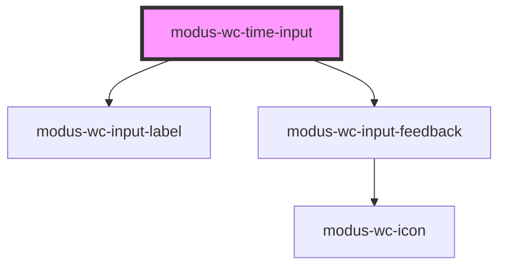

# modus-wc-time-input

<!-- Auto Generated Below -->

## Overview

A customizable time input with a native time field plus a Modus dropdown
(scrollable picker wheels or a datalist of interval options).

`value` is always stored and emitted in 24-hour format (`HH:mm` or `HH:mm:ss`).
The field uses the browser’s native `<input type="time">` (built-in clock icon
and sizing). `hourFormat` controls the Modus picker (12h wheels + AM/PM vs 24h)
and sets `lang` to bias the native field toward 12h (`en-US`) or 24h (`en-GB`)
where the browser supports it.

Adheres to WCAG 2.2 standards.

## Properties

| Property          | Attribute          | Description                                                                                                                                                                                                                                                                                  | Type                                | Default     |
| ----------------- | ------------------ | -------------------------------------------------------------------------------------------------------------------------------------------------------------------------------------------------------------------------------------------------------------------------------------------- | ----------------------------------- | ----------- |
| `autoComplete`    | `auto-complete`    | Hint for form autofill feature.                                                                                                                                                                                                                                                              | `"off" \| "on" \| undefined`        | `undefined` |
| `bordered`        | `bordered`         | Indicates that the input should have a border.                                                                                                                                                                                                                                               | `boolean \| undefined`              | `true`      |
| `customClass`     | `custom-class`     | Custom CSS class to apply to the input.                                                                                                                                                                                                                                                      | `string \| undefined`               | `''`        |
| `datalistId`      | `datalist-id`      | **[DEPRECATED]** Native HTML datalist is no longer used. Prefer `datalistOptions`. Kept for backward compatibility; when set, the suggestion list is shown.                                                                                           | `string \| undefined`               | `undefined` |
| `datalistOptions` | `datalist-options` | Pre-defined time options for the suggestion list. Values must be in `HH:mm` or `HH:mm:ss` (24-hour) format. When provided (non-empty), the clock menu shows this list instead of picker wheels. When empty, options can still be generated from `interval-minutes` if that attribute is set. | `string[]`                          | `[]`        |
| `disabled`        | `disabled`         | Whether the form control is disabled.                                                                                                                                                                                                                                                        | `boolean \| undefined`              | `false`     |
| `feedback`        | `feedback`         | Feedback to render below the input.                                                                                                                                                                                                                                                          | `IInputFeedbackProp \| undefined`   | `undefined` |
| `hourFormat`      | `hour-format`      | Hour clock for the Modus picker wheels / datalist labels. - `24h` (default): hours wheel 00–23 - `12h`: hours wheel 01–12 with AM/PM  Also sets `lang` on the native field (`en-GB` / `en-US`) to bias browser 24h vs 12h presentation where supported. `value` / `inputChange` stay 24h.    | `"12h" \| "24h" \| undefined`       | `'24h'`     |
| `inputId`         | `input-id`         | The ID of the input element.                                                                                                                                                                                                                                                                 | `string \| undefined`               | `undefined` |
| `inputTabIndex`   | `input-tab-index`  | Determine the control's relative ordering for sequential focus navigation.                                                                                                                                                                                                                   | `number \| undefined`               | `undefined` |
| `intervalMinutes` | `interval-minutes` | Interval in minutes used to generate suggestion-list options when `datalistOptions` is empty. Set the `interval-minutes` attribute to opt into the list (instead of picker wheels). Default: 15.                                                                                             | `number \| undefined`               | `15`        |
| `label`           | `label`            | The text to display within the label.                                                                                                                                                                                                                                                        | `string \| undefined`               | `undefined` |
| `max`             | `max`              | Maximum value. Format: `HH:mm`, `HH:mm:ss`.                                                                                                                                                                                                                                                  | `string \| undefined`               | `undefined` |
| `min`             | `min`              | Minimum value. Format: `HH:mm`, `HH:mm:ss`.                                                                                                                                                                                                                                                  | `string \| undefined`               | `undefined` |
| `name`            | `name`             | Name of the form control.                                                                                                                                                                                                                                                                    | `string \| undefined`               | `undefined` |
| `readOnly`        | `read-only`        | Whether the value is editable.                                                                                                                                                                                                                                                               | `boolean \| undefined`              | `false`     |
| `required`        | `required`         | A value is required for the form to be submittable.                                                                                                                                                                                                                                          | `boolean \| undefined`              | `false`     |
| `showSeconds`     | `show-seconds`     | Displays seconds in the field and picker. Internally treats step as 1 second when no explicit `step` is set.                                                                                                                                                                                 | `boolean \| undefined`              | `false`     |
| `size`            | `size`             | The size of the input.                                                                                                                                                                                                                                                                       | `"lg" \| "md" \| "sm" \| undefined` | `'md'`      |
| `step`            | `step`             | Granularity in seconds. When set, minute/second wheels and generated datalist options respect this step. Overrides the default implied by `showSeconds` for option generation.                                                                                                               | `number \| undefined`               | `undefined` |
| `value`           | `value`            | The value of the time input in 24-hour format with leading zeros: `HH:mm` or `HH:mm:ss`.                                                                                                                                                                                                     | `string`                            | `''`        |

## Events

| Event         | Description                                                                                              | Type                      |
| ------------- | -------------------------------------------------------------------------------------------------------- | ------------------------- |
| `inputBlur`   | Event emitted when the input loses focus.                                                                | `CustomEvent<FocusEvent>` |
| `inputChange` | Event emitted when the input value changes. `detail` is an InputEvent; read `detail.target.value` (24h). | `CustomEvent<Event>`      |
| `inputFocus`  | Event emitted when the input gains focus.                                                                | `CustomEvent<FocusEvent>` |

## Dependencies

### Depends on

- [modus-wc-input-label](../modus-wc-input-label)
- [modus-wc-input-feedback](../modus-wc-input-feedback)

### Graph

----------------------------------------------

*Built with [StencilJS](https://stenciljs.com/)*
