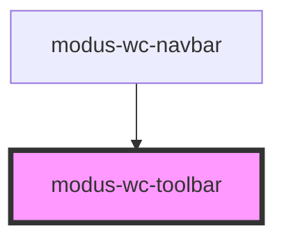

# modus-wc-toolbar

<!-- Auto Generated Below -->

## Overview

A customizable toolbar component used to organize content across the entire page.

## Properties

| Property      | Attribute      | Description                                 | Type                  | Default |
| ------------- | -------------- | ------------------------------------------- | --------------------- | ------- |
| `customClass` | `custom-class` | Custom CSS class to apply to the outer div. | `string \| undefined` | `''`    |

## Dependencies

### Used by

 - [modus-wc-navbar](../modus-wc-navbar)

### Graph

----------------------------------------------

*Built with [StencilJS](https://stenciljs.com/)*
