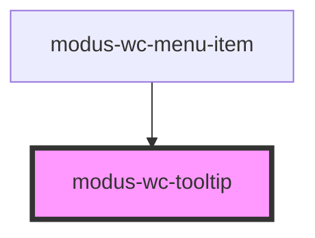

# modus-wc-tooltip

<!-- Auto Generated Below -->

## Overview

A customizable tooltip component used to create tooltips with different content.

The tooltip can be dismissed by pressing the Escape key when hovering over it.
When forceOpen is enabled, the tooltip will remain open and can only be closed by setting forceOpen to false.

## Properties

| Property      | Attribute      | Description                                                                                             | Type                                                            | Default     |
| ------------- | -------------- | ------------------------------------------------------------------------------------------------------- | --------------------------------------------------------------- | ----------- |
| `content`     | `content`      | The text content of the tooltip.                                                                        | `string`                                                        | `''`        |
| `customClass` | `custom-class` | Custom CSS class to apply to the inner div.                                                             | `string \| undefined`                                           | `''`        |
| `disabled`    | `disabled`     | Disables displaying the tooltip on hover                                                                | `boolean \| undefined`                                          | `false`     |
| `forceOpen`   | `force-open`   | Use this attribute to force the tooltip to remain open.                                                 | `boolean \| undefined`                                          | `undefined` |
| `position`    | `position`     | The position that the tooltip will render in relation to the element.                                   | `"auto" \| "bottom" \| "left" \| "right" \| "top" \| undefined` | `'auto'`    |
| `tooltipId`   | `tooltip-id`   | The ID of the tooltip element, useful for setting the "aria-describedby" attribute of related elements. | `string \| undefined`                                           | `undefined` |

## Events

| Event           | Description                                                      | Type               |
| --------------- | ---------------------------------------------------------------- | ------------------ |
| `dismissEscape` | An event that fires when the tooltip is dismissed via Escape key | `CustomEvent<any>` |

## Dependencies

### Used by

 - [modus-wc-menu-item](../modus-wc-menu-item)

### Graph

----------------------------------------------

*Built with [StencilJS](https://stenciljs.com/)*
