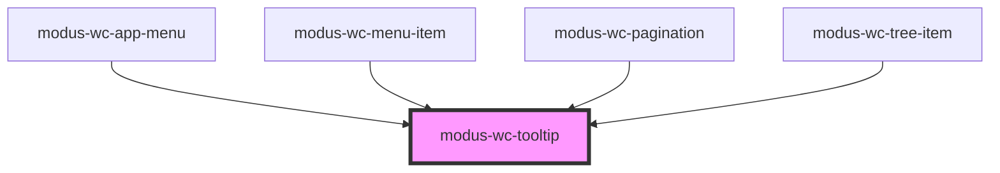

# modus-wc-tooltip

<!-- Auto Generated Below -->

## Overview

A customizable tooltip component used to create tooltips with different content.

The tooltip opens on hover and keyboard focus of the wrapped trigger, and closes on
pointer leave, focus leave, or Escape (without moving focus). When forceOpen is enabled,
the tooltip remains open and Escape does not dismiss it.
Use the contentElement prop to supply rich HTML content to the tooltip such as multiline text.
For plain dynamic text, prefer the content prop instead. When contentElement is set, it takes precedence over the content prop.

For screen reader support, set `tooltip-id` on this component and matching `aria-describedby`
on the trigger (e.g. modus-wc-button).

## Properties

| Property         | Attribute         | Description                                                                                                                                                                         | Type                                                            | Default     |
| ---------------- | ----------------- | ----------------------------------------------------------------------------------------------------------------------------------------------------------------------------------- | --------------------------------------------------------------- | ----------- |
| `content`        | `content`         | The text content of the tooltip. When contentElement is also set, contentElement takes precedence.                                                                                  | `string`                                                        | `''`        |
| `contentElement` | `content-element` | An optional rich HTML element to render as the tooltip body. When set, this takes precedence over the `content` string prop. The element is deep-cloned into the tooltip container. | `HTMLElement \| undefined`                                      | `undefined` |
| `customClass`    | `custom-class`    | Custom CSS class to apply to the inner div.                                                                                                                                         | `string \| undefined`                                           | `''`        |
| `disabled`       | `disabled`        | Disables displaying the tooltip on hover and focus                                                                                                                                  | `boolean \| undefined`                                          | `false`     |
| `forceOpen`      | `force-open`      | Use this attribute to force the tooltip to remain open.                                                                                                                             | `boolean \| undefined`                                          | `undefined` |
| `position`       | `position`        | The position that the tooltip will render in relation to the element.                                                                                                               | `"auto" \| "bottom" \| "left" \| "right" \| "top" \| undefined` | `'auto'`    |
| `tooltipId`      | `tooltip-id`      | The ID of the tooltip tip element (`role="tooltip"`). For screen reader support, add `aria-describedby` with this value to your trigger element.                                    | `string \| undefined`                                           | `undefined` |

## Events

| Event           | Description                                                      | Type               |
| --------------- | ---------------------------------------------------------------- | ------------------ |
| `dismissEscape` | An event that fires when the tooltip is dismissed via Escape key | `CustomEvent<any>` |

## Dependencies

### Used by

 - [modus-wc-app-menu](../modus-wc-app-menu)
 - [modus-wc-menu-item](../modus-wc-menu-item)
 - [modus-wc-pagination](../modus-wc-pagination)
 - [modus-wc-tree-item](../modus-wc-tree-item)

### Graph

```mermaid
graph TD;
  modus-wc-app-menu --> modus-wc-tooltip
  modus-wc-menu-item --> modus-wc-tooltip
  modus-wc-pagination --> modus-wc-tooltip
  modus-wc-tree-item --> modus-wc-tooltip
  style modus-wc-tooltip fill:#f9f,stroke:#333,stroke-width:4px
```

----------------------------------------------

*Built with [StencilJS](https://stenciljs.com/)*
