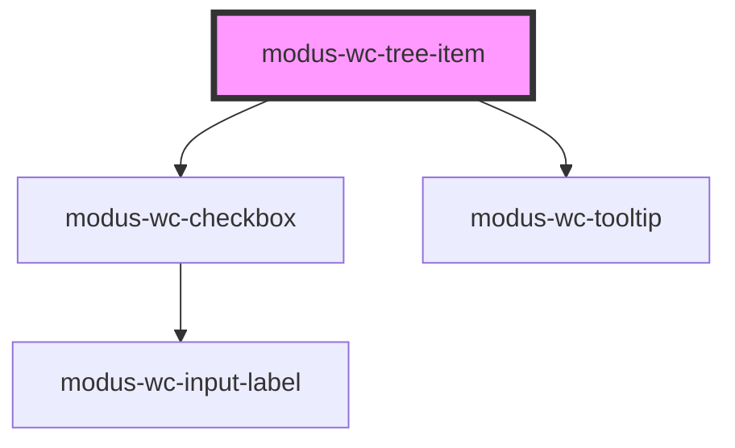

# modus-wc-tree-item

<!-- Auto Generated Below -->

## Overview

A customizable tree item component used to display the item portion of a tree view.

This component supports `start` and `end` slots for custom content at the beginning and end of the item.

## Properties

| Property          | Attribute          | Description                                                                                                                                                                                                                              | Type                                                            | Default     |
| ----------------- | ------------------ | ---------------------------------------------------------------------------------------------------------------------------------------------------------------------------------------------------------------------------------------- | --------------------------------------------------------------- | ----------- |
| `blockExpand`     | `block-expand`     | When true, prevents the built-in inline submenu toggle on click. The item will only emit `itemSelect` so the consumer can handle the expansion externally (e.g. show a flyout panel). Only has an effect when `hasSubmenu` is also true. | `boolean \| undefined`                                          | `undefined` |
| `bordered`        | `bordered`         |                                                                                                                                                                                                                                          | `boolean \| undefined`                                          | `undefined` |
| `checkbox`        | `checkbox`         | If true, renders a checkbox at the start of the tree item.                                                                                                                                                                               | `boolean \| undefined`                                          | `undefined` |
| `customClass`     | `custom-class`     | Custom CSS class to apply to the li element.                                                                                                                                                                                             | `string \| undefined`                                           | `''`        |
| `disabled`        | `disabled`         | The disabled state of the tree item.                                                                                                                                                                                                     | `boolean \| undefined`                                          | `undefined` |
| `focused`         | `focused`          | The focused state of the tree item.                                                                                                                                                                                                      | `boolean \| undefined`                                          | `undefined` |
| `hasSubmenu`      | `has-submenu`      | Whether this tree item has a collapsible submenu. When true, the item will show a caret and handle toggle behavior.                                                                                                                      | `boolean \| undefined`                                          | `undefined` |
| `label`           | `label`            | The text rendered in the tree item.                                                                                                                                                                                                      | `string`                                                        | `''`        |
| `selected`        | `selected`         | The selected state of the tree item.                                                                                                                                                                                                     | `boolean \| undefined`                                          | `undefined` |
| `size`            | `size`             | The size of the tree item.                                                                                                                                                                                                               | `"lg" \| "md" \| "sm" \| undefined`                             | `'md'`      |
| `subLabel`        | `sub-label`        | The text rendered beneath the label.                                                                                                                                                                                                     | `string \| undefined`                                           | `undefined` |
| `tooltipContent`  | `tooltip-content`  | The tooltip text to display when hovering over the tree item.                                                                                                                                                                            | `string \| undefined`                                           | `undefined` |
| `tooltipPosition` | `tooltip-position` | The position of the tooltip relative to the tree item.                                                                                                                                                                                   | `"auto" \| "bottom" \| "left" \| "right" \| "top" \| undefined` | `'auto'`    |
| `value`           | `value`            | The unique identifying value of the tree item.                                                                                                                                                                                           | `string`                                                        | `''`        |

## Events

| Event        | Description                                 | Type                                                               |
| ------------ | ------------------------------------------- | ------------------------------------------------------------------ |
| `itemSelect` | Event emitted when a tree item is selected. | `CustomEvent<{ value: string; selected?: boolean \| undefined; }>` |

## Methods

### `collapseSubmenu() => Promise<void>`

Public method to collapse the submenu if it's expanded

#### Returns

Type: `Promise<void>`

## Dependencies

### Depends on

- [modus-wc-checkbox](../modus-wc-checkbox)
- [modus-wc-tooltip](../modus-wc-tooltip)

### Graph

----------------------------------------------

*Built with [StencilJS](https://stenciljs.com/)*
