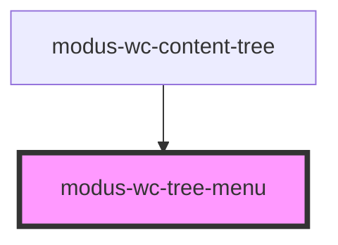

# modus-wc-tree-menu

<!-- Auto Generated Below -->

## Overview

A customizable tree menu component used to display a list of modus-wc-tree-item elements vertically or horizontally.

The component supports a `<slot>` for injecting custom modus-wc-tree-item elements inside the ul element.

## Properties

| Property        | Attribute        | Description                                            | Type                                      | Default      |
| --------------- | ---------------- | ------------------------------------------------------ | ----------------------------------------- | ------------ |
| `bordered`      | `bordered`       | Indicates that the tree menu should have a border.     | `boolean \| undefined`                    | `undefined`  |
| `customClass`   | `custom-class`   | Custom CSS class to apply to the ul element.           | `string \| undefined`                     | `''`         |
| `isSubMenu`     | `is-sub-menu`    | Indicates that this tree menu is a submenu (dropdown). | `boolean \| undefined`                    | `undefined`  |
| `orientation`   | `orientation`    | The orientation of the tree menu.                      | `"horizontal" \| "vertical" \| undefined` | `'vertical'` |
| `selectionMode` | `selection-mode` | The selection mode of the tree menu.                   | `"multiple" \| "single" \| undefined`     | `'single'`   |
| `size`          | `size`           | The size of the tree menu.                             | `"lg" \| "md" \| "sm" \| undefined`       | `'md'`       |

## Events

| Event                 | Description                                                                                                                    | Type                                             |
| --------------------- | ------------------------------------------------------------------------------------------------------------------------------ | ------------------------------------------------ |
| `menuFocusout`        | Event emitted when the tree menu loses focus.                                                                                  | `CustomEvent<FocusEvent>`                        |
| `menuSelectionChange` | Event emitted when the selection changes in multiple selection mode. Emits the array of currently selected tree item elements. | `CustomEvent<{ selectedItems: HTMLElement[]; }>` |

## Dependencies

### Used by

 - [modus-wc-content-tree](../modus-wc-content-tree)

### Graph

----------------------------------------------

*Built with [StencilJS](https://stenciljs.com/)*
