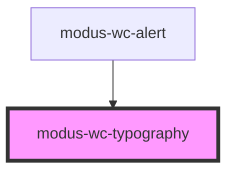

# modus-wc-typography

<!-- Auto Generated Below -->

## Overview

A customizable typography component used to render text with different sizes, variants, and weights.

Adheres to WCAG 2.2 standards.

## Properties

| Property      | Attribute      | Description                                          | Type                                                            | Default    |
| ------------- | -------------- | ---------------------------------------------------- | --------------------------------------------------------------- | ---------- |
| `customClass` | `custom-class` | Custom CSS class to apply to the typography element. | `string \| undefined`                                           | `''`       |
| `size`        | `size`         | The size of the font.                                | `"lg" \| "md" \| "sm" \| "xs" \| undefined`                     | `'md'`     |
| `variant`     | `variant`      | The variant of the typography component.             | `"body" \| "h1" \| "h2" \| "h3" \| "h4" \| "h5" \| "h6" \| "p"` | `'p'`      |
| `weight`      | `weight`       | The weight of the text.                              | `"bold" \| "light" \| "normal" \| undefined`                    | `'normal'` |

## Dependencies

### Used by

 - [modus-wc-alert](../modus-wc-alert)

### Graph

----------------------------------------------

*Built with [StencilJS](https://stenciljs.com/)*
