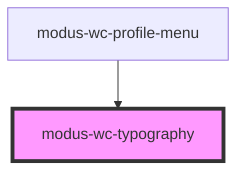

# modus-wc-typography

<!-- Auto Generated Below -->

## Overview

A customizable typography component used to render text with different sizes, hierarchy, and weights.

Note:
- When using heading elements (h1-h6), the default heading CSS styling can be accessed without modifying
the default size (size="md") and weight (weight="normal") properties. Default styling can be overridden by
providing your own custom values for the size or weight properties from the available options.

- If both slot content and `label` are provided, only the slot content will be rendered
- Use the `label` prop when you need to dynamically update the text.

## Properties

| Property             | Attribute      | Description                                          | Type                                                                  | Default     |
| -------------------- | -------------- | ---------------------------------------------------- | --------------------------------------------------------------------- | ----------- |
| `customClass`        | `custom-class` | Custom CSS class to apply to the typography element. | `string \| undefined`                                                 | `''`        |
| `hierarchy`          | `hierarchy`    | The hierarchy of the typography component.           | `"h1" \| "h2" \| "h3" \| "h4" \| "h5" \| "h6" \| "p"`                 | `'p'`       |
| `label` _(required)_ | `label`        | The text label to display.                           | `string`                                                              | `undefined` |
| `size`               | `size`         | The size of the font.                                | `"2xl" \| "3xl" \| "lg" \| "md" \| "sm" \| "xl" \| "xs" \| undefined` | `'md'`      |
| `weight`             | `weight`       | The weight of the text.                              | `"bold" \| "light" \| "normal" \| "semibold" \| undefined`            | `'normal'`  |

## Dependencies

### Used by

 - [modus-wc-profile-menu](../modus-wc-profile-menu)

### Graph

----------------------------------------------

*Built with [StencilJS](https://stenciljs.com/)*
