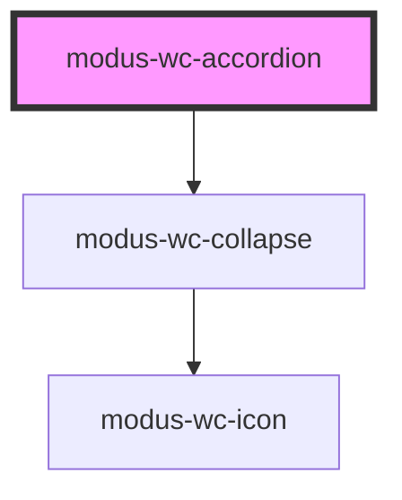

# modus-wc-accordion

<!-- Auto Generated Below -->

## Overview

A customizable accordion component used for showing and hiding related groups of content.

Adheres to WCAG 2.2 standards.

## Properties

| Property      | Attribute      | Description                                           | Type                                        | Default |
| ------------- | -------------- | ----------------------------------------------------- | ------------------------------------------- | ------- |
| `bordered`    | `bordered`     | Indicates that the component should have a border.    | `boolean \| undefined`                      | `true`  |
| `customClass` | `custom-class` | Custom CSS class to apply to the inner div.           | `string \| undefined`                       | `''`    |
| `items`       | --             | Accordion items, used to render collapse components * | `IModusWcAccordionItem[]`                   | `[]`    |
| `size`        | `size`         | Sets the size of the accordion component.             | `"lg" \| "md" \| "sm" \| "xs" \| undefined` | `'md'`  |

## Events

| Event            | Description                                                                                | Type                                                 |
| ---------------- | ------------------------------------------------------------------------------------------ | ---------------------------------------------------- |
| `expandedChange` | When a collapse expanded state is changed, this event outputs the relevant index and state | `CustomEvent<{ expanded: boolean; index: number; }>` |

## Dependencies

### Depends on

- [modus-wc-collapse](../modus-wc-collapse)

### Graph

----------------------------------------------

*Built with [StencilJS](https://stenciljs.com/)*
