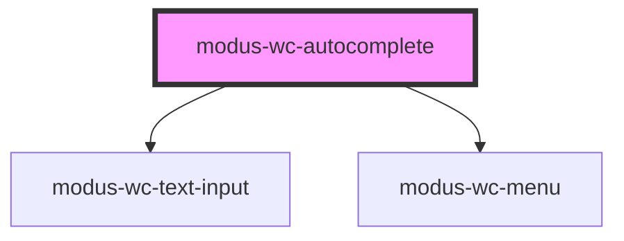

# modus-wc-autocomplete

<!-- Auto Generated Below -->

## Overview

A customizable autocomplete component used to create searchable text inputs.

Adheres to WCAG 2.2 standards.

## Properties

| Property                 | Attribute           | Description                                                                                             | Type                                          | Default     |
| ------------------------ | ------------------- | ------------------------------------------------------------------------------------------------------- | --------------------------------------------- | ----------- |
| `activeItemValue`        | `active-item-value` | The active menu item value, used to show an item as selected.                                           | `string \| undefined`                         | `undefined` |
| `ariaDescribedby`        | `aria-describedby`  | The ID of the element that describes the input.                                                         | `string \| undefined`                         | `undefined` |
| `ariaLabel` _(required)_ | `aria-label`        | The aria-label attribute for accessibility.                                                             | `string`                                      | `undefined` |
| `bordered`               | `bordered`          | Indicates that the autocomplete should have a border.                                                   | `boolean \| undefined`                        | `true`      |
| `customClass`            | `custom-class`      | Custom CSS class to apply to host element.                                                              | `string \| undefined`                         | `''`        |
| `debounceMs`             | `debounce-ms`       | The debounce timeout in milliseconds. Set to 0 to disable debouncing.                                   | `number \| undefined`                         | `300`       |
| `disabled`               | `disabled`          | Whether the form control is disabled.                                                                   | `boolean \| undefined`                        | `false`     |
| `inputDir`               | `input-dir`         | Specifies the text direction of the input content.                                                      | `"" \| "auto" \| "ltr" \| "rtl" \| undefined` | `undefined` |
| `inputId`                | `input-id`          | The ID of the input element.                                                                            | `string \| undefined`                         | `undefined` |
| `inputTabIndex`          | `input-tab-index`   | Determine the control's relative ordering for sequential focus navigation (typically with the Tab key). | `number \| undefined`                         | `undefined` |
| `items`                  | --                  | The items to display in the menu.                                                                       | `IMenuItem[]`                                 | `[]`        |
| `minChars`               | `min-chars`         | The minimum number of characters required to render the menu.                                           | `number`                                      | `0`         |
| `name`                   | `name`              | Name of the form control. Submitted with the form as part of a name/value pair.                         | `string \| undefined`                         | `undefined` |
| `placeholder`            | `placeholder`       | Text that appears in the form control when it has no value set.                                         | `string \| undefined`                         | `''`        |
| `readOnly`               | `read-only`         | Whether the value is editable.                                                                          | `boolean \| undefined`                        | `false`     |
| `required`               | `required`          | A value is required for the form to be submittable.                                                     | `boolean \| undefined`                        | `false`     |
| `size`                   | `size`              | The size of the autocomplete (input and menu).                                                          | `"lg" \| "md" \| "sm" \| undefined`           | `'md'`      |
| `value`                  | `value`             | The value of the control.                                                                               | `string`                                      | `''`        |

## Events

| Event         | Description                                                                                       | Type                      |
| ------------- | ------------------------------------------------------------------------------------------------- | ------------------------- |
| `inputBlur`   | Event emitted when the input loses focus.                                                         | `CustomEvent<FocusEvent>` |
| `inputChange` | Event emitted when the input value changes. This event is debounced based on the debounceMs prop. | `CustomEvent<Event>`      |
| `inputFocus`  | Event emitted when the input gains focus.                                                         | `CustomEvent<FocusEvent>` |
| `itemSelect`  | Event emitted when a menu item is selected.                                                       | `CustomEvent<IMenuItem>`  |

## Dependencies

### Depends on

- [modus-wc-text-input](../../atoms/modus-wc-text-input)
- [modus-wc-menu](../../atoms/modus-wc-menu)

### Graph

----------------------------------------------

*Built with [StencilJS](https://stenciljs.com/)*
