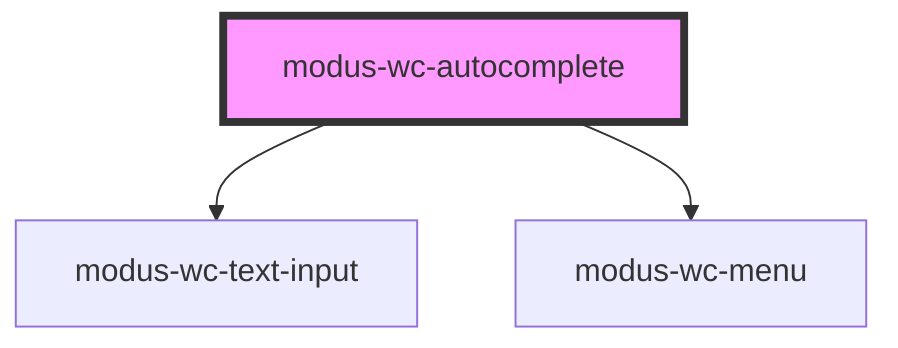

# modus-wc-autocomplete

<!-- Auto Generated Below -->

## Overview

A customizable autocomplete component used to create searchable text inputs.

Adheres to WCAG 2.2 standards.

## Properties

| Property      | Attribute      | Description                                                           | Type               | Default                                                                            |
| ------------- | -------------- | --------------------------------------------------------------------- | ------------------ | ---------------------------------------------------------------------------------- |
| `customClass` | `custom-class` | Custom CSS class to apply to host element.                            | `string`           | `''`                                                                               |
| `debounceMs`  | `debounce-ms`  | The debounce timeout in milliseconds. Set to 0 to disable debouncing. | `number`           | `300`                                                                              |
| `menu`        | `menu`         |                                                                       | `ModusWcMenu`      | `{ ariaLabel: 'Autocomplete menu', items: [] }`                                    |
| `textInput`   | `text-input`   |                                                                       | `ModusWcTextInput` | `{     ariaLabel: 'Autocomplete input',     inputMode: 'text',     value: '',   }` |

## Events

| Event            | Description                                                                                       | Type                                                   |
| ---------------- | ------------------------------------------------------------------------------------------------- | ------------------------------------------------------ |
| `inputBlur`      | Event emitted when the input loses focus.                                                         | `CustomEvent<ModusWcTextInputCustomEvent<FocusEvent>>` |
| `inputChange`    | Event emitted when the input value changes. This event is debounced based on the debounceMs prop. | `CustomEvent<ModusWcTextInputCustomEvent<Event>>`      |
| `inputFocus`     | Event emitted when the input gains focus.                                                         | `CustomEvent<ModusWcTextInputCustomEvent<FocusEvent>>` |
| `menuItemSelect` | Event emitted when a menu item is selected.                                                       | `CustomEvent<ModusWcMenuCustomEvent<IMenuItem>>`       |

## Dependencies

### Depends on

- [modus-wc-text-input](../../atoms/modus-wc-text-input)
- [modus-wc-menu](../../atoms/modus-wc-menu)

### Graph

----------------------------------------------

*Built with [StencilJS](https://stenciljs.com/)*
