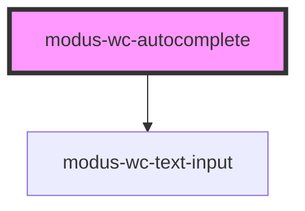

# modus-wc-autocomplete

<!-- Auto Generated Below -->

## Overview

A customizable autocomplete component used to create searchable text inputs.

Adheres to WCAG 2.2 standards.

## Properties

| Property                 | Attribute      | Description                                                           | Type                                | Default     |
| ------------------------ | -------------- | --------------------------------------------------------------------- | ----------------------------------- | ----------- |
| `ariaLabel` _(required)_ | `aria-label`   | The aria-label attribute for accessibility.                           | `string`                            | `undefined` |
| `customClass`            | `custom-class` | Custom CSS class to apply to host element.                            | `string`                            | `''`        |
| `debounceMs`             | `debounce-ms`  | The debounce timeout in milliseconds. Set to 0 to disable debouncing. | `number`                            | `300`       |
| `size`                   | `size`         | The size of the input.                                                | `"lg" \| "md" \| "sm" \| undefined` | `'md'`      |
| `value`                  | `value`        | The value of the control.                                             | `string`                            | `''`        |

## Events

| Event         | Description                                                                                       | Type                                                   |
| ------------- | ------------------------------------------------------------------------------------------------- | ------------------------------------------------------ |
| `inputBlur`   | Event emitted when the input loses focus.                                                         | `CustomEvent<ModusWcTextInputCustomEvent<FocusEvent>>` |
| `inputChange` | Event emitted when the input value changes. This event is debounced based on the debounceMs prop. | `CustomEvent<ModusWcTextInputCustomEvent<Event>>`      |
| `inputFocus`  | Event emitted when the input gains focus.                                                         | `CustomEvent<ModusWcTextInputCustomEvent<FocusEvent>>` |

## Dependencies

### Depends on

- [modus-wc-text-input](../../atoms/modus-wc-text-input)

### Graph

----------------------------------------------

*Built with [StencilJS](https://stenciljs.com/)*
