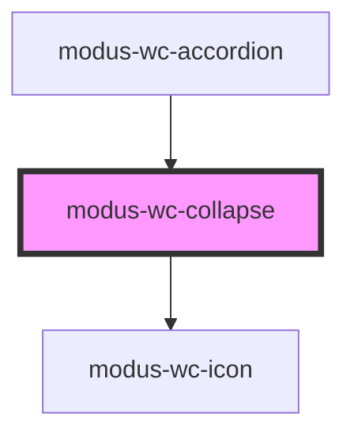

# modus-wc-collapse

<!-- Auto Generated Below -->

## Overview

A customizable collapse component used for showing and hiding content.

Can render any HTML content through a <slot> element.

Adheres to WCAG 2.2 standards.

## Properties

| Property              | Attribute              | Description                                                 | Type                                        | Default |
| --------------------- | ---------------------- | ----------------------------------------------------------- | ------------------------------------------- | ------- |
| `bordered`            | `bordered`             | Indicates that the component should have a border.          | `boolean \| undefined`                      | `true`  |
| `collapseDescription` | `collapse-description` | The description of the collapse component.                  | `string \| undefined`                       | `''`    |
| `collapseTitle`       | `collapse-title`       | The title of the collapse component.                        | `string \| undefined`                       | `''`    |
| `customClass`         | `custom-class`         | Custom CSS class to apply to the inner div.                 | `string \| undefined`                       | `''`    |
| `expanded`            | `expanded`             | Controls whether the collapse is expanded or not.           | `boolean \| undefined`                      | `false` |
| `icon`                | `icon`                 | The icon name, should match the CSS class in the icon font. | `string \| undefined`                       | `''`    |
| `iconAriaLabel`       | `icon-aria-label`      | Sets the aria-label attribute of the icon component.        | `string \| undefined`                       | `''`    |
| `size`                | `size`                 | Sets the size of the collapse component.                    | `"lg" \| "md" \| "sm" \| "xs" \| undefined` | `'md'`  |

## Events

| Event            | Description                                                 | Type                   |
| ---------------- | ----------------------------------------------------------- | ---------------------- |
| `expandedChange` | Event emitted when the expanded prop is internally changed. | `CustomEvent<boolean>` |

## Dependencies

### Used by

 - [modus-wc-accordion](../modus-wc-accordion)

### Depends on

- [modus-wc-icon](../../atoms/modus-wc-icon)

### Graph

----------------------------------------------

*Built with [StencilJS](https://stenciljs.com/)*
