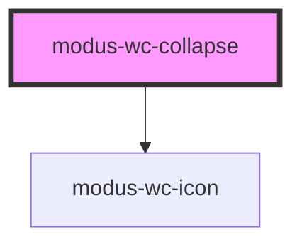

# modus-wc-collapse

<!-- Auto Generated Below -->

## Overview

A customizable collapse component used for showing and hiding content.

Adheres to WCAG 2.2 standards.

## Properties

| Property        | Attribute         | Description                                                 | Type                   | Default |
| --------------- | ----------------- | ----------------------------------------------------------- | ---------------------- | ------- |
| `bordered`      | `bordered`        | Indicates that the component should have a border.          | `boolean \| undefined` | `true`  |
| `customClass`   | `custom-class`    | Custom CSS class to apply to the inner div.                 | `string \| undefined`  | `''`    |
| `expanded`      | `expanded`        | Controls whether the collapse is expanded or not.           | `boolean \| undefined` | `false` |
| `icon`          | `icon`            | The icon name, should match the CSS class in the icon font. | `string \| undefined`  | `''`    |
| `iconAriaLabel` | `icon-aria-label` | Sets the aria-label attribute of the icon component.        | `string \| undefined`  | `''`    |
| `title`         | `title`           | The title of the collapse component, rendered on button.    | `string \| undefined`  | `''`    |

## Dependencies

### Depends on

- [modus-wc-icon](../../atoms/modus-wc-icon)

### Graph

----------------------------------------------

*Built with [StencilJS](https://stenciljs.com/)*
