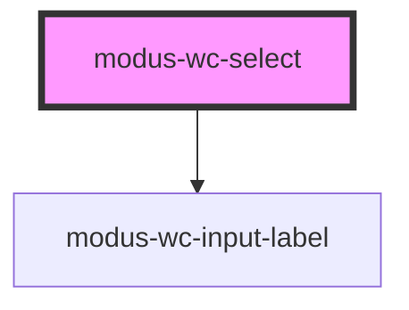

# modus-wc-select

<!-- Auto Generated Below -->

## Overview

A customizable select component used to pick a value from a list of options.

Adheres to WCAG 2.2 standards.

## Properties

| Property        | Attribute         | Description                                                                                             | Type                                | Default     |
| --------------- | ----------------- | ------------------------------------------------------------------------------------------------------- | ----------------------------------- | ----------- |
| `bordered`      | `bordered`        | Indicates that the input should have a border.                                                          | `boolean \| undefined`              | `true`      |
| `customClass`   | `custom-class`    | Custom CSS class to apply to the inner div.                                                             | `string \| undefined`               | `''`        |
| `disabled`      | `disabled`        | Whether the form control is disabled.                                                                   | `boolean \| undefined`              | `false`     |
| `inputId`       | `input-id`        | The ID of the input element.                                                                            | `string \| undefined`               | `undefined` |
| `inputTabIndex` | `input-tab-index` | Determine the control's relative ordering for sequential focus navigation (typically with the Tab key). | `number \| undefined`               | `undefined` |
| `label`         | `label`           | The text to display within the label.                                                                   | `string \| undefined`               | `undefined` |
| `name`          | `name`            | Name of the form control. Submitted with the form as part of a name/value pair.                         | `string \| undefined`               | `undefined` |
| `options`       | --                | The options to display in the select dropdown.                                                          | `ISelectOption[]`                   | `[]`        |
| `required`      | `required`        | A value is required for the form to be submittable.                                                     | `boolean \| undefined`              | `false`     |
| `size`          | `size`            | The size of the input.                                                                                  | `"lg" \| "md" \| "sm" \| undefined` | `'md'`      |
| `value`         | `value`           | The value of the control.                                                                               | `string`                            | `''`        |

## Events

| Event         | Description                                 | Type                      |
| ------------- | ------------------------------------------- | ------------------------- |
| `inputBlur`   | Event emitted when the input loses focus.   | `CustomEvent<FocusEvent>` |
| `inputChange` | Event emitted when the input value changes. | `CustomEvent<InputEvent>` |
| `inputFocus`  | Event emitted when the input gains focus.   | `CustomEvent<FocusEvent>` |

## Dependencies

### Depends on

- [modus-wc-input-label](../../atoms/modus-wc-input-label)

### Graph

----------------------------------------------

*Built with [StencilJS](https://stenciljs.com/)*
