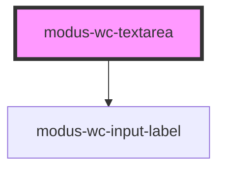

# modus-wc-textarea

<!-- Auto Generated Below -->

## Overview

A customizable textarea component.

Adheres to WCAG 2.2 standards.

## Properties

| Property        | Attribute         | Description                                                                     | Type                                                                                   | Default     |
| --------------- | ----------------- | ------------------------------------------------------------------------------- | -------------------------------------------------------------------------------------- | ----------- |
| `autoCorrect`   | `auto-correct`    | Controls automatic correction in inputted text. Support by browser varies.      | `"off" \| "on" \| undefined`                                                           | `undefined` |
| `bordered`      | `bordered`        | Indicates that the input should have a border.                                  | `boolean \| undefined`                                                                 | `true`      |
| `customClass`   | `custom-class`    | Custom CSS class to apply to the textarea (supports DaisyUI).                   | `string \| undefined`                                                                  | `''`        |
| `disabled`      | `disabled`        | The disabled state of the textarea.                                             | `boolean \| undefined`                                                                 | `false`     |
| `enterkeyhint`  | `enterkeyhint`    | A hint to the browser for which enter key to display.                           | `"done" \| "enter" \| "go" \| "next" \| "previous" \| "search" \| "send" \| undefined` | `undefined` |
| `inputId`       | `input-id`        | The ID of the input element.                                                    | `string \| undefined`                                                                  | `undefined` |
| `inputTabIndex` | `input-tab-index` | The tabindex of the input.                                                      | `number \| undefined`                                                                  | `undefined` |
| `label`         | `label`           | The text to display within the label.                                           | `string \| undefined`                                                                  | `undefined` |
| `maxLength`     | `max-length`      | The maximum number of characters allowed in the textarea.                       | `number \| undefined`                                                                  | `undefined` |
| `name`          | `name`            | Name of the form control. Submitted with the form as part of a name/value pair. | `string \| undefined`                                                                  | `undefined` |
| `placeholder`   | `placeholder`     | The placeholder text for the textarea.                                          | `string \| undefined`                                                                  | `''`        |
| `readonly`      | `readonly`        | The readonly state of the textarea.                                             | `boolean \| undefined`                                                                 | `false`     |
| `required`      | `required`        | A value is required for the form to be submittable.                             | `boolean \| undefined`                                                                 | `false`     |
| `rows`          | `rows`            | The number of visible text lines for the textarea.                              | `number \| undefined`                                                                  | `undefined` |
| `size`          | `size`            | The size of the input.                                                          | `"lg" \| "md" \| "sm" \| undefined`                                                    | `'md'`      |
| `value`         | `value`           | The value of the textarea.                                                      | `string`                                                                               | `''`        |

## Events

| Event         | Description                           | Type                      |
| ------------- | ------------------------------------- | ------------------------- |
| `inputBlur`   | Emitted when the input loses focus.   | `CustomEvent<FocusEvent>` |
| `inputChange` | Emitted when the input value changes. | `CustomEvent<InputEvent>` |
| `inputFocus`  | Emitted when the input gains focus.   | `CustomEvent<FocusEvent>` |

## Dependencies

### Depends on

- [modus-wc-input-label](../../atoms/modus-wc-input-label)

### Graph

----------------------------------------------

*Built with [StencilJS](https://stenciljs.com/)*
